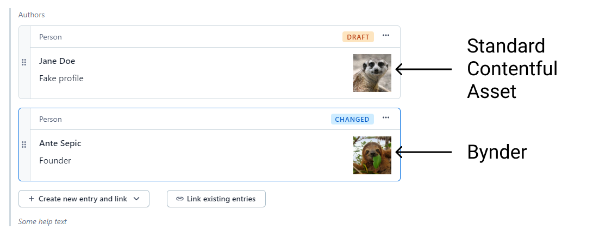

# References with DAM support

This is a proof of concept app for Contentful adding support for a quick-preview of Bynder assets in reference cards.

By default, Contentful will display the first image asset it finds attached to an entry inside of a reference card. When you use one of the apps from the marketplace for your assets however, you lose the quick image preview capabilities. This app is an exploration of adding support for DAM ssets preview inside entry cards.

## Current drawbacks/limitations:

- Supports only Bynder (the official Bynder app from Contentful's marketplace), let me know if you need support for some other DAM
- Due to the limitations of how field-level apps are implemented in Contentful (iframe), re-implementation of the reference field loses its appeal somewhat because dropdowns triggered inside of the field are potentially cut off and one has to scroll to reach options within it
- Current reference default field editor was not extendable enough to add support for custom asset thumbnail so the whole package had to be basically copy-pasted into this project and then customized - this could be improved by Contentful by allowing custom asset thumbnail component passing as a prop

## Installation:

1. In your organization, go to Apps and create a new App Definition
2. Call it whatever makes sense to you, and put `https://contentful-app-references-with-dam-support.vercel.app` as a Frontend value
3. Check "App configuration screen" and "Entry field" locations
4. Under "Entry field" check "Entry reference" and "Entry reference, list"
5. Click create
6. Go back to your space -> Content model -> Edit content model which holds the reference field for which you want to enable the app
7. Open that field settings and under Appearance assign the app you just created and save the content model
8. Your reference fields should now show Bynder asset as a preview inside of the referenced entry cards

This project was bootstrapped with [Create Contentful App](https://github.com/contentful/create-contentful-app).
